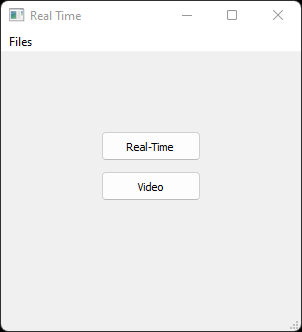
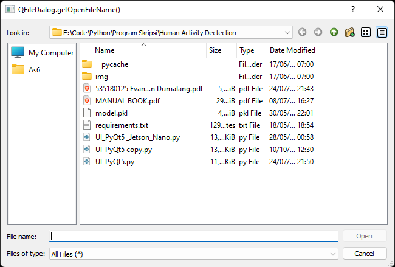
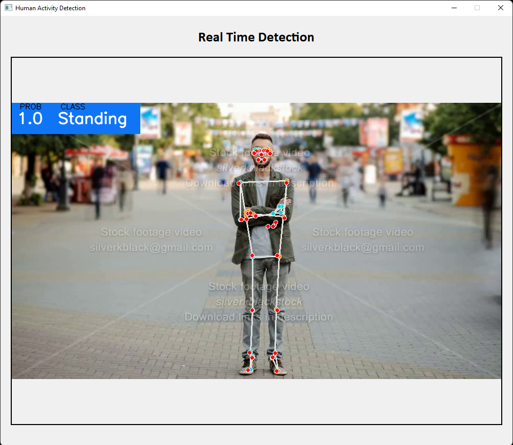

[![LinkedIn][linkedin-shield]][linkedin-url]

[linkedin-shield]: https://img.shields.io/badge/-LinkedIn-black.svg?style=for-the-badge&logo=linkedin&colorB=555
[linkedin-url]: https://www.linkedin.com/in/evanderchristiandumalang/

# Human Activity Recognition GUI

### Python Human Activity Recognition

Classification (Stand, Walk and Pick)

### Built With

* [![Python][Python.org]][Python-url]

[Python.org]: https://img.shields.io/badge/Python-FFFFFF?style=for-the-badge&logo=python&logoColor=blue
[Python-url]: https://www.python.org/

## Documentation

### App Preview
  

### Demo

## Installation

- Add [Python](https://www.python.org/downloads/) to your machine

- Open this project folder with Terminal/CMD and run `pip install -r requirement.txt`

- Run `python GUI.py` 

## Contributing

Contributions are what make the open source community such an amazing place to learn, inspire, and create. Any contributions you make are **greatly appreciated**.

If you have a suggestion that would make this better, please fork the repo and create a pull request.

## License

All the code available under the MIT licenses. See [LICENSE](LICENSE).

## References

Nicholas Renotte - AI Body Language Decoder with MediaPipe and Python in 90 Minutes
https://youtu.be/We1uB79Ci-w
